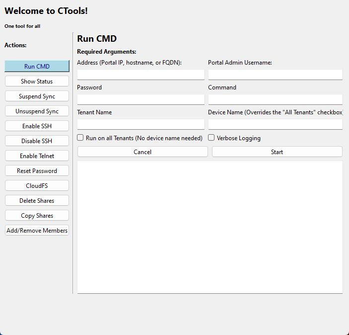

# CTools

## Description

A toolbox of tasks to check and manage CTERA Edge Filers via GUI.

## Requirements

1. **Use a Portal Global Administrator account to login.**

- There is currently no support for tenant admins or direct logins to Edge Filers. All requests are sent through the Portal to connected Edge Filers.

2. **Ensure necessary Remote Administration settings are enabled on the portal:** (Applies to portal versions older than 7.2)

    Access the Global Administration view > Navigate to Settings > Control Panel > User Roles > Read/Write Administrator -> Ensure "Allow Single Sign On to Devices" is checked

    - [documentation](https://kb.ctera.com/v1/docs/en/customizing-administrator-roles-1?highlight=Allow%20Single%20Sign%20On%20to%20Devices) 

## Please review this document to learn more about each tool

## Development Requirements

- [CTERA Environment](https://www.ctera.com/)
- [CTERA SDK for Python](https://github.com/ctera/ctera-python-sdk)
- [Python](https://www.python.org/downloads/)
- [git](https://git-scm.com/)
- [PySide6](https://pypi.org/project/PySide6/)

## Setup

### Linux

General instructions. Actual commands will vary by distro and version.
```
git clone https://github.com/ctera/ctools.git
python -m pip install -r ctools/requirements.txt
```

### Windows

For a machine without Python and git already installed, you can use these steps to simplify setup.
Here we use [Chocolatey](https://chocolatey.org/) as a commmand line package manager for Windows.
Run PowerShell as an Administrator to setup. Close and re-open PowerShell
after to refresh the environment and enable tab completion of commands.

```
Set-ExecutionPolicy Bypass -Scope Process -Force; [System.Net.ServicePointManager]::SecurityProtocol = [System.Net.ServicePointManager]::SecurityProtocol -bor 3072; iex ((New-Object System.Net.WebClient).DownloadString('https://community.chocolatey.org/install.ps1'))
choco install python --yes
choco install git --yes
# Close and re-open your shell
git clone https://github.com/ctera/ctools.git
python -m pip install --upgrade pip
python -m pip install -r .\ctools\requirements.txt
cd ctools
```

# To launch the GUI, invoke ctools.py
```
python ctools.py
```

#### Run CMD 

Run a "hidden CLI command", i.e. execute a RESTful API request to each connected Edge Filer or to one specified Edge Filer.

#### Show Status

Record current status of connected Edge Filers to a specified CSV output file.
Provide a portal URL, e.g. portal.ctera.me, to scan all connected Edge Filers to that tenant and write various bits of
information to a specified CSV file.
If an IP address is provided, the Default Tenant Portal will be used.
Or you can use/check the `-a, --all` flag to scan all connected Edge Filers across all Tenant Portals.
If the output filename already exists, the results will be appended to the existing file.

#### Suspend Sync / Unsuspend Sync

Suspend or Unususpend Cloud Drive syncing on a Edge Filer.

#### Enable SSH / Disable SSH

Enable or Disable the ssh service on a given Edge Filer and add the public key to the authorized_keys of the Edge Filer.
If no public key is provided, a new keypair will generated and saved to the Downloads folder.

#### Enable Telnet

Enable the telnet service on a given Edge Filer. If no unlock code is provided, return the required MAC address
and firmware version to get an unlock code from CTERA Support.

#### Reset Password
Reset a local user account password on a Edge Filer.

#### CloudFS
Create folder_groups and cloud folders using a pre-populated CSV file - download template [here](./templates/cloud_folders.csv)
- Replace content in file above with desired folder_group and cloud_folder names

#### Delete Shares
Delete shares from all Gateway devices containing specified pattern

#### Copy Shares
Copy Shares from one specified Edge Filer to a different specified Edge Filer

#### Add/Remove Members
Add/remove domain users/groups to the Administrators group on all devices on all portals, all devices on specified portal tenant, or one device on specified portal tenant

```
PS C:\Users\ctera\git\ctools> python ctools.py
```

